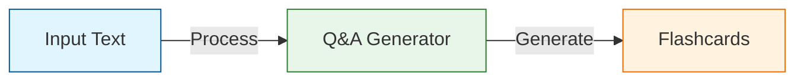
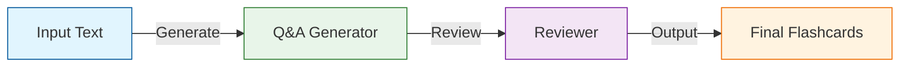
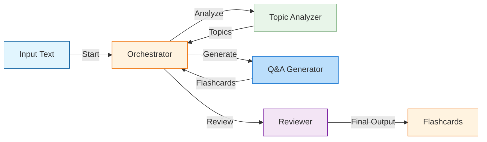
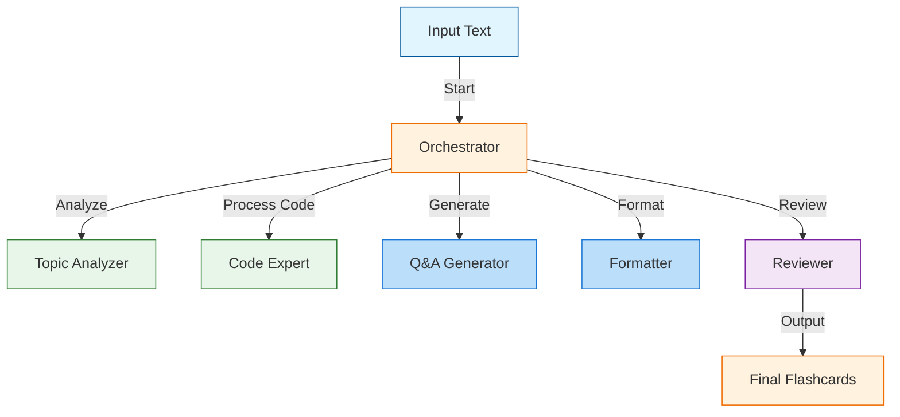

# Flashcard Generator using a Multi-Agent Framework with LlamaIndex

Welcome to the **Flashcard Generator** project! This tutorial demonstrates how to build a multi-agent system using **LlamaIndex** to create high-quality Anki flashcards from any given text. Multi-agent systems simulate teams of specialized workers, where each agent has a unique role in achieving complex tasks.

---

## Project Overview
This project builds progressively from a single-agent system to a multi-agent system with orchestration, introducing new features and capabilities at each stage. The system generates Anki flashcards efficiently by leveraging the power of specialized agents working collaboratively.

### Key Features
- **Incremental Development**: Start simple and scale up.
- **Multi-Agent Collaboration**: Agents work together, each with a defined role.
- **Error Handling**: Retry mechanisms and validation for robustness.
- **Consistent Output**: Flashcards follow a structured and standardized format.
- **Expandable Design**: Easily add new agents and features.

---

## Versions and Architectures

### **Version 1: Basic Single-Agent System**
A single agent generates flashcards from text input.

#### Architecture


#### Key Features
- Single-agent focus: Q&A Generator.
- Data validation using **Pydantic**.
- Basic structured output for Anki flashcards.

#### Limitations
- No quality control.
- Limited topic understanding.
- No feedback loop for iterative improvement.

---

### **Version 2: Two-Agent System**
Introduces a second agent for reviewing and improving flashcards.

#### Architecture


#### Key Features
- Reviewer agent ensures better flashcard quality.
- Iterative refinement via a two-step process.
- Cloze deletions for effective learning.

#### Limitations
- Basic quality control.
- No advanced topic analysis or memory.

---

### **Version 3: Multi-Agent System with Orchestrator**
Adds an **Orchestrator Agent** to coordinate multiple specialized agents.

#### Architecture


#### Key Features
- Topic Analyzer agent breaks content into manageable parts.
- Orchestrator dynamically manages workflow.
- Persistent memory for maintaining context.

#### Limitations
- Lacks specialized agents for advanced tasks like code handling.

---

### **Version 4: Enhanced Capabilities**
Introduces agents for handling specific content types and formatting.

#### Architecture


#### Key Features
- Code Expert handles programming content.
- Formatter ensures consistent output.
- Robust error handling and validation.

---

## Getting Started

### Prerequisites
- Python 3.10+
- Install dependencies:
  ```bash
  pip install -r requirements.txt
  ```

### Installation
1. Clone the repository:
   ```bash
   git clone https://github.com/your-username/flashcard-generator.git
   cd flashcard-generator
   ```
2. Set up your environment:
   ```bash
   python -m venv env
   source env/bin/activate  # On Windows, use `env\Scripts\activate`
   ```
3. Install required packages:
   ```bash
   pip install -r requirements.txt
   ```

---

## Future Enhancements
- **Parallel Processing**: Concurrent agent execution.
- **Multi-language Support**: Expanding usability.
- **Image and Audio Integration**: Rich multimedia flashcards.
- **Adaptive Learning**: Feedback-based improvement.

---

## Conclusion
This project demonstrates how multi-agent collaboration can be leveraged for complex workflows. Each version showcases incremental improvements, providing a template for designing your own multi-agent systems.

Happy building! 🚀
